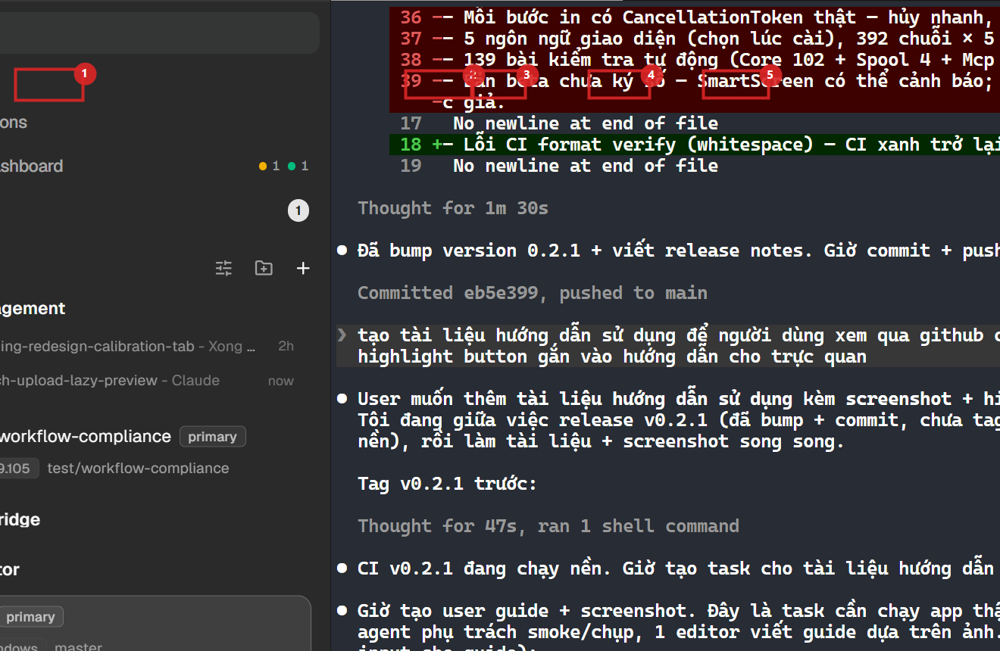
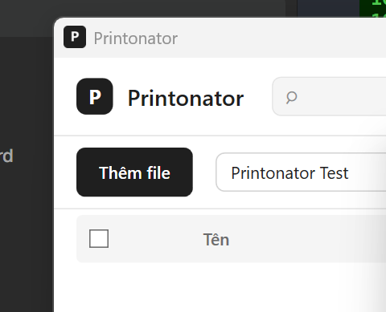

# Hướng dẫn sử dụng Printonator

> **Phần mềm in hàng loạt** — kéo thả file, chọn máy in, in cả lô.
> Windows 10/11, 5 ngôn ngữ (VI/EN/ZH/RU/JA), hỗ trợ PDF/DOCX/XLSX/PPTX/ảnh/TXT.

---

## 1. Giao diện chính

| Số | Nút | Chức năng |
|---|---|---|
| 1 | **Thêm file** | Mở hộp thoại chọn file (hỗ trợ PDF, DOCX, XLSX, PPTX, ảnh, TXT). Cũng có thể **kéo thả** file vào cửa sổ hoặc **dán (Ctrl+V)** đường dẫn/clipboard. |
| 2 | **Cài đặt in** | Mở cửa sổ cấu hình in cho các file đang chọn (số bản, khổ giấy, 2 mặt, màu, trang, dấu mờ...). |
| 3 | **Máy in** | Mở danh sách máy in + trạng thái (online/offline), nút mở cài đặt driver máy in. |
| 4 | **Theo dõi** | **Printing Server**: chọn 1 thư mục dùng chung — ai ném file vào → tự in ngay vào máy in mặc định. Xem tiếp [mục 6](#6-theo-dõi-thư-mục-printing-server). |
| 5 | **In tất cả** | In toàn bộ file trong hàng đợi. Nếu có file được chọn → nút hiện "In (N)". |

**Header:** tìm kiếm file (⌕), thông báo (bell 🔔 — bản mới, in xong...).

**Hàng đợi:** danh sách file chờ in, xem nhanh trạng thái (✓ Done, ↻ Converting, ⏳ Queued, lỗi), cấu hình (số bản, khổ, 2 mặt...). Click vào cột Cài đặt để sửa nhanh.

**Footer:** số file trong hàng đợi, thanh tiến trình in, gợi ý thao tác.

---

## 2. Cài đặt in

Mở từ nút **Cài đặt in** trên toolbar hoặc click cột Cài đặt của từng dòng.

### Tab Cơ bản
- **Số bản in** (1-999)
- **Khoảng trang** — All / 1,3,5 / 1-5 / S2:1-3 (section) / **last** (trang cuối) / **last3** (3 trang cuối)
- **Khổ giấy** — theo máy in / theo file (khổ gốc) / A4/A3...
- **In 2 mặt** — 1 mặt / 2 mặt lật cạnh dài / 2 mặt lật cạnh ngắn / theo máy
- **Màu sắc** — màu / đen trắng / theo máy

### Tab Nâng cao
- **Trang lẻ/chẵn** — All / Chẵn / Lẻ
- **Gom bản / Rời bản**
- **Khay giấy** — chọn khay nạp giấy cụ thể
- **Chiều in** — dọc / ngang / theo file
- **Tỷ lệ** — vừa khổ / thu nhỏ / lấp đầy / zoom%
- **N-up** — 1-16 trang/tờ, kèm đóng sách (Booklet)
- **Chất lượng** — theo driver / Cao / Trung bình / Nháp
- **Dấu mờ (Watermark)** — nhập chữ, chọn độ mờ

### Lưu cấu hình (Preset)
Sau khi chọn xong cấu hình, bấm **Lưu** → đặt tên → lần sau chọn từ combo Profile để áp dụng nhanh. Có thể **Xuất** preset ra file `.printonator` để chia sẻ, hoặc **Nhập** từ file người khác.

---

## 3. Preset (cấu hình in nhanh)

Nút **Cấu hình** trên toolbar mở cửa sổ Quản lý cấu hình:
- Danh sách preset đã lưu
- **Đổi tên**, **Xóa**, **Áp dụng** (áp vào file đang chọn hoặc cấu hình mặc định)
- Preset lưu trong `%APPDATA%\Printonator\presets.json`

---

## 4. Duyệt in (Job từ AI)

Khi AI (MCP) gửi lệnh in, job sẽ ở trạng thái **chờ duyệt** (AwaitingApproval) — xuất hiện thanh Duyệt in phía trên danh sách:
- **Duyệt tất cả** → job vào hàng đợi, in bình thường
- **Từ chối tất cả** → job chuyển Cancelled
- **✕** → đóng thanh, job giữ chờ duyệt (có thể duyệt qua MCP `approve_job`)

---

## 5. Hủy lô

Nút **Hủy lô** (cạnh nút In tất cả):
- Hủy toàn bộ file đang chờ + đang in
- Job đang in sẽ dừng engine thật (job → Cancelled, không lỗi)
- Xác nhận trước khi hủy

---

## 6. Theo dõi thư mục (Printing Server)

> **Kịch bản:** cài Printonator trên máy chung phòng ban, tạo 1 thư mục dùng chung qua LAN. Người khác ném file vào → tự in ngay vào máy in mặc định Windows.

**Cách dùng:**
1. **Bật Full mode** (xem [mục 8](#8-chế-độ-litefull))
2. Nút **Theo dõi** trên toolbar → chọn thư mục → app tự động theo dõi
3. Bất kỳ ai gửi file vào thư mục đó → file được in ngay (toàn bộ cấu hình theo file, không ép A4/dọc/2 mặt)
4. Mỗi file in xong có **thông báo "Đã in: {tên file}"** ở bell — biết ai in gì, máy chung không lo lộn xộn
5. File lỗi (hỏng, không mở được) → báo lỗi trong hàng đợi, không phá lô

**Lưu ý:**
- Chỉ 1 máy nên theo dõi 1 thư mục — tránh 2 máy cùng in 1 file
- File Office (Word/Excel/PPT) in qua app gốc giữ đúng định dạng (font, bảng, công thức)
- Mọi file đều in vào **máy in mặc định của máy chạy Printonator**

---

## 7. Lịch sử in

App tự động lưu lịch sử 1000 bản in gần nhất vào `%APPDATA%\Printonator\history.json`:
- Tên file, đường dẫn
- Kết quả (Done/Error/Cancelled)
- Thời gian in, số bản, số trang
- Nguồn gửi (User / MCP / Watch Folder)

---

## 8. Chế độ Lite/Full

- **Lite** (mặc định): giao diện gọn, phù hợp đa số người dùng. Ẩn các tính năng nâng cao (theo dõi thư mục, máy in từng file, dấu mờ, gộp file, trang bìa...).
- **Full**: hiện đủ tính năng.

**Đổi chế độ:** Cửa sổ **Giới thiệu** (ⓘ góc phải dưới) → combo **Chế độ** → chọn Full/Lite → Khởi động lại app.

---

## 9. 5 ngôn ngữ

Chọn ngôn ngữ lúc cài đặt (Inno Setup), hoặc đổi sau trong Cửa sổ **Giới thiệu** → combo **Ngôn ngữ** → khởi động lại. Hỗ trợ: Tiếng Việt, English, 中文, Русский, 日本語.

---

## 10. Các tính năng khác

- **Menu chuột phải Explorer:** click phải file → "In với Printonator" → tự mở app + in luôn (cài khi cài app, tự động).
- **CLI (dòng lệnh):** `tools\printonator.ps1 list-printers` — in qua MCP server từ terminal (yêu cầu app đang mở).
- **Dán từ clipboard:** Copy đường dẫn file (Ctrl+C) → trong app Ctrl+V — thêm file vào hàng đợi.
- **Kéo thả file:** Kéo file từ Explorer vào cửa sổ app.
- **Tự động xóa file đã in:** popup "In xong" sau mỗi lô có checkbox "Xóa file đã in khỏi hàng đợi".
- **Kiểm tra bản mới:** bell (🔔) → "Kiểm tra bản mới" — hoặc tự kiểm tra nền khi có mạng.

---

## 11. Yêu cầu hệ thống

- Windows 10/11 **64-bit**
- .NET Desktop Runtime 8.0+ (installer tự cài nếu thiếu)
- RAM tối thiểu 2GB, khuyến nghị 4GB
- Ổ cứng 100MB cho app
- **Để in file Office:** cần Microsoft Office 2010+ hoặc LibreOffice
- **Để in PDF/ảnh/TXT với khổ giấy/page range:** cần Chrome/Edge (browser có sẵn trên máy)
- **Để dùng MCP (AI in):** cần MCP client (Claude, Cline...)

---

## 12. Hỗ trợ

- **GitHub:** [nanowind/Printonator](https://github.com/nanowind/Printonator) — báo lỗi, đề xuất tính năng qua Issues
- **Email:** phucnguyenqlcn@gmail.com
- **Zalo:** +84 907 907 804
- **Giấy phép:** MIT © 2026 Phuc Nguyen